 

<!--

-->

---

## 👨‍💻 About Me

Final Year Computer Science Engineering student focused on **backend engineering**, **cloud-native development**, and **DevOps automation**. I design and build **scalable, containerized applications**, implement **CI/CD pipelines**, and work with **REST APIs, real-time systems (WebSockets), and relational databases**. I also practice **Data Structures & Algorithms** regularly to sharpen problem-solving skills.

> *Building scalable applications, automating deployments, and solving problems one commit at a time.*

---

## 🌱 Currently

- 🔭 Building **[VaultBox](https://github.com/Shivansh3127/VaultBox)**, a distributed file storage service, and extending **[SimpleCI](https://github.com/Shivansh3127/SimpleCI)**
- 📚 Learning **Kubernetes** (container orchestration) and **Hyperledger** (enterprise blockchain)
- 💬 Ask me about backend development, DevOps, CI/CD, and cloud technologies

---

## 🎯 Core Competencies

| Domain | Focus Areas |
|---|---|
| **Backend Engineering** | RESTful API design, WebSockets and real-time log streaming, ORM-based data modeling, relational databases (PostgreSQL) |
| **DevOps & CI/CD** | Pipeline automation, webhook-triggered builds, YAML-driven pipeline configuration, Git workflows |
| **Containerization & Cloud** | Docker, container isolation, Kubernetes (learning), AWS, S3-compatible object storage |
| **Systems Design** | Chunked and resumable uploads, content deduplication (SHA-256), pre-signed URLs, caching and queues with Redis |
| **Computer Science Fundamentals** | Data Structures & Algorithms, OOP in Java and C++, problem solving |

---

## 🚀 Featured Projects

### 🔧 [SimpleCI](https://github.com/Shivansh3127/SimpleCI): Lightweight CI Server

A self-hosted continuous integration server. A repository webhook triggers an isolated Docker container that executes the steps defined in a `.simpleci.yaml` file, and logs stream live to a web dashboard.

- ⚡ **Webhook-triggered pipelines** with custom YAML parsing (no hardcoded steps)
- 🐳 **Isolated build execution** in Docker containers using `dockerode`
- 📡 **Real-time log streaming** to the dashboard over WebSockets
- 🗄️ **Run and log persistence** with PostgreSQL and Prisma

`Node.js` `TypeScript` `Express` `Docker` `WebSockets` `PostgreSQL` `Prisma` `React (Vite)`

---

### 📦 [VaultBox](https://github.com/Shivansh3127/VaultBox): Distributed File Storage Service 🚧 *In progress*

A Dropbox-style storage backend focused on reliability and efficiency for large files.

- 🧩 **Chunked, resumable uploads** with per-chunk checksum verification
- 🔁 **Content deduplication** using SHA-256 hashing
- 🔐 **Pre-signed URLs** so the server never proxies file bytes
- 🧹 **Planned:** versioning, shareable links, storage quotas, and orphan-chunk cleanup worker

`Node.js` `TypeScript` `Express` `PostgreSQL` `Redis` `Docker` `S3-compatible storage`

---

## 🧰 Tech Stack

### 💻 Languages & Web

### ⚙️ Backend & Databases

### ☁️ Cloud & DevOps

### 🛠️ Tools & Platforms

---

<!--
## 📊 GitHub Stats
Uncomment once your activity grows.

---
-->

## 📫 Connect with Me

  

